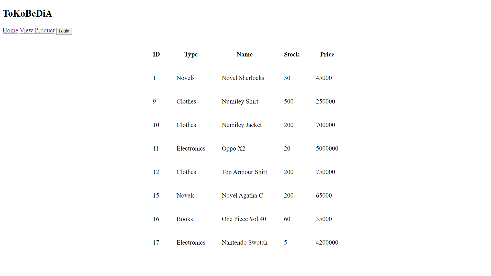
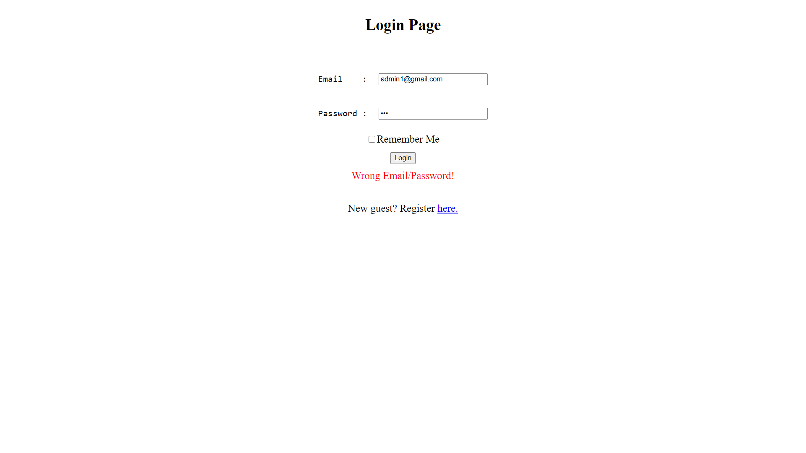
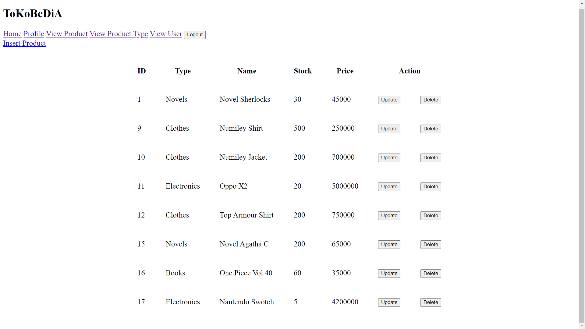
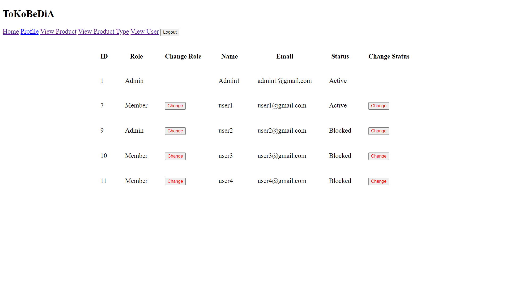

# Tokobedia-Individual
This is a project to fulfill requirement in Pattern Software Design Laboratory Subject at Bina Nusantara University.

## Descriptions
This website is an imitation "Tokopedia", and please <b>note</b> that this project emphasize the back end side, with less front end. 

  In this project, there are different roles, as the user and admin. 
 You can add, update, delete product and change user's status(active/blocked) as admin
 You can only see product and update your profile (email/name/gender/password)as a user

  All of the features above are ready to use in this project
 Please have a quick look with project's preview below. Thank you!

## Run Guide
You can run this project with Visual Studio 2015 or newer, and from View/Homepage.aspx file

## Project's Preview

 

 

 

 

## Technologies
▸ HTML 
▸ C# 
▸ ASP.net 
▸ Javascript 
▸ Visual Studio 2015 
